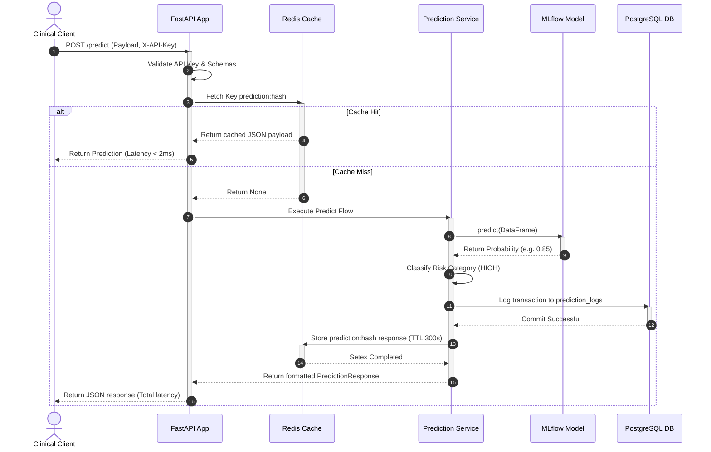

# Enterprise Disease Risk Serving Platform

A high-performance, production-grade clinical risk assessment platform that serves real-time machine learning predictions for diabetes risk and logs clinical activities.

---

## 1. Project Overview

The **Enterprise Disease Risk Serving Platform** is built using Python, FastAPI, MLflow Model Registry, PostgreSQL, Redis Cache, and Docker. It solves the critical healthcare business problem of early disease identification (specifically Diabetes Risk Prediction) by offering a high-throughput, low-latency prediction API.

### Key Features
- **Real-Time Prediction Engine:** Multi-stage FastAPI application with strict schema validation.
- **MLflow Model Registry:** Loads production-flagged models dynamically.
- **Redis Response Caching:** Computes MD5 payload hashes to cache repeated prediction requests (300-second TTL), reducing model invocation latency to sub-millisecond ranges.
- **PostgreSQL Transaction Logging:** Persists every prediction record, inputs, outputs, classification results, and latency measurements for auditability.
- **Security:** API Key Authentication via header validation (`X-API-Key`).
- **Resilience:** Global exception mapping for graceful error recovery.

---

## 2. Healthcare Business Problem

Hospitals and clinical organizations face a critical challenge in chronic disease management:
* **Late-Stage Diagnoses:** Conditions like Diabetes are often detected only after complications (neuropathy, retinopathy, nephropathy) emerge. Early symptoms go unrecognized, leading to delayed diagnoses and higher treatment costs.
* **Clinical Workflow Friction:** Physicians have limited time during consultations. Manually entering patient data into external tools is inefficient, and standard ML platforms lack secure REST APIs for direct Integration with **Electronic Health Records (EHR)**.
* **Patient Compliance:** Failing to provide risk assessments during the initial consultation reduces the likelihood of patients returning for follow-up testing or preventive care.

### Business Outcomes & Value Created:
1. **Reduced Hospital Readmissions:** Early, data-driven identification of high-risk patients enables proactive preventive care (nutritional guidance, early therapies), reducing readmission rates.
2. **EHR Interoperability:** High-speed REST endpoints serve predictions in milliseconds, allowing clinic software systems to fetch risk scores automatically during patient visits.
3. **Standardized Clinical Risk Scoring:** Subjectivity in disease risk assessment is replaced by consistent classification rules (LOW, MEDIUM, HIGH risk levels) backed by machine learning probabilities.
4. **Data Auditing:** Every prediction transaction is securely logged, creating an anonymized dataset for healthcare audit reports and research.

---

## 3. Architecture Design & Technical Design

### 3.1 High-Level Design (HLD)

#### System Architecture Flow
```mermaid
graph TD
    Client[Doctors / Analysts]
    API_Gateway[FastAPI Application]
    Redis_Cache[(Redis Cache)]
    Postgres_DB[(PostgreSQL DB)]
    MLflow_Server[MLflow Model Registry]
    MLflow_Storage[(MLflow Artifacts Store)]

    Client -->|1. POST /predict (with X-API-Key)| API_Gateway
    Client -->|2. GET /predictions| API_Gateway
    
    API_Gateway -->|3. Query Cache (MD5 Hash)| Redis_Cache
    
    %% Prediction Flow on Cache Miss %%
    API_Gateway -->|4. Load/Predict Model| API_Gateway
    API_Gateway -->|5. Write to DB| Postgres_DB
    API_Gateway -->|6. Cache Result (TTL 300s)| Redis_Cache
    
    %% MLflow Model Loading %%
    API_Gateway -->|7. Load production model| MLflow_Server
    MLflow_Server -->|8. Fetch artifacts| MLflow_Storage
```

#### Component Interaction Sequence Diagram


---

### 3.2 Low-Level Design (LLD)

#### Database Schema (`prediction_logs`)
Stored in PostgreSQL. Mapped via SQLAlchemy:
```sql
CREATE TABLE prediction_logs (
    id UUID PRIMARY KEY,
    patient_id VARCHAR(100) INDEXED,
    request_data JSONB,
    prediction_result JSONB,
    disease_probability FLOAT,
    latency_ms FLOAT,
    model_version VARCHAR(50),
    created_at TIMESTAMP
);
```

#### Cache Key Design
- **Key Prefix:** `prediction:{md5_hash_of_sorted_request_payload}`
- **TTL:** 300 seconds (5 minutes).
- **Fail-safe:** If Redis is down, log error, fall back to direct model execution, and return prediction. Return an error response if the platform is configured to enforce strict DB/Cache availability.

#### Risk Classification Business Rules
The disease probability output from the model (`0.00` to `1.00`) is classified using the following thresholds:
- **`0.00 - 0.30`** : `LOW` Risk Level / `LOW_RISK` Prediction Label
- **`0.31 - 0.70`** : `MEDIUM` Risk Level / `MEDIUM_RISK` Prediction Label
- **`0.71 - 1.00`** : `HIGH` Risk Level / `HIGH_RISK` Prediction Label

---

### 3.3 Project File Structure

```text
Real-Time Disease Risk Prediction/
├── app/
│   ├── api/
│   │   ├── routes/
│   │   │   ├── __init__.py
│   │   │   ├── model.py            # Routes for model metadata and manual reload
│   │   │   └── predictions.py      # Routes for predictions and log retrieval
│   │   ├── __init__.py
│   │   └── dependencies.py         # DB sessions and security header injection
│   ├── core/
│   │   ├── __init__.py
│   │   ├── config.py               # Settings loader using Pydantic Settings
│   │   ├── exceptions.py           # Global HTTP and service exception handlers
│   │   └── security.py             # API Key header validation middleware
│   ├── database/
│   │   ├── __init__.py
│   │   ├── models.py               # SQLAlchemy database mapping
│   │   └── session.py              # PostgreSQL database engine connection pooling
│   ├── models/
│   │   ├── __init__.py
│   │   └── prediction.py           # Pydantic input validation models
│   ├── services/
│   │   ├── __init__.py
│   │   ├── cache_service.py        # Redis cache manager client
│   │   ├── logging_service.py      # Database logs persistency client
│   │   ├── model_service.py        # MLflow model loader interface
│   │   └── prediction_service.py   # Primary pipeline serving coordinator
│   ├── __init__.py
│   └── main.py                     # App entry point, startup hooks, health route
├── docs/                           # Dedicated technical documentation library
├── scripts/
│   └── train_and_register.py       # Bootstrap training & model register script
├── tests/
│   ├── conftest.py                 # SQLite, Redis client, MLflow mock environment
│   ├── test_api.py                 # Endpoint and authentication tests
│   ├── test_cache.py               # Cache hashing and error checks
│   ├── test_database.py            # Data transaction integration tests
│   └── test_model.py               # Boundary risk classifications unit tests
├── Dockerfile                      # Secure multi-stage python build
├── docker-compose.yml              # Container infrastructure composer
├── requirements.txt                # Python libraries
├── .env                            # Credentials and variables configuration
└── README.md
```

---

## 4. Setup Guide

### Option A: Running with Docker Compose (Recommended)
This spins up the database, cache, MLflow registry, boots the registry with a trained model, and starts the serving service.

1. **Pre-requisites:** Make sure Docker and Docker Compose are installed.
2. **Environment Variables:** Verify settings in `.env` (default configurations are set up for Docker Compose).
3. **Spin up Services:**
   ```bash
   docker-compose up --build -d
   ```
4. **Bootstrapping Process:**
   - The `mlflow-init` container waits for the MLflow server to start, generates a synthetic diabetes patient dataset, trains a Random Forest Classifier, registers it as `disease-risk-model`, and promotes the registered version to `Production`.
   - The FastAPI `app` container waits for this bootstrap step to complete successfully, then starts serving.
5. **View MLflow UI:** Open `http://localhost:5000` to view the MLflow experiments and models.

---

### Option B: Running Locally for Development

1. **Install Dependencies:**
   ```bash
   pip install -r requirements.txt
   ```
2. **Setup Local Mock Database/Redis:**
   Ensure local PostgreSQL and Redis instances are running, and update `.env` hosts from `db`/`redis` to `localhost`.
3. **Train & Register Model:**
   Start your MLflow tracking server locally:
   ```bash
   mlflow server --host 127.0.0.1 --port 5000 --backend-store-uri sqlite:///mlflow.db
   ```
   Then run the bootstrap script to log the model:
   ```bash
   python scripts/train_and_register.py
   ```
4. **Start serving API:**
   ```bash
   uvicorn app.main:app --reload --port 8000
   ```

---

## 5. API Documentation

All endpoints require authorization using the `X-API-Key` header (except health-check). Default key: `dev-secret-key-12345`.

### 1. Health Check
* Checks connectivity of database, cache, and MLflow model.
* **Endpoint:** `GET /health`
* **Response (200 OK):**
  ```json
  {
      "status": "healthy",
      "environment": "development",
      "services": {
          "database": "connected",
          "cache": "connected",
          "model": "loaded"
      }
  }
  ```

### 2. Predict Disease Risk
* Calculates disease probability, risk level, logs to PostgreSQL, and writes to cache.
* **Endpoint:** `POST /predict`
* **Headers:** `X-API-Key: dev-secret-key-12345`
* **Request Body:**
  ```json
  {
      "patient_id": "PAT-1001",
      "age": 45,
      "gender": "Male",
      "bmi": 31.5,
      "glucose_level": 185.0,
      "blood_pressure": 145.0,
      "insulin_level": 120.0,
      "family_history": true
  }
  ```
* **Response (200 OK):**
  ```json
  {
      "patient_id": "PAT-1001",
      "disease_probability": 0.85,
      "risk_level": "HIGH",
      "prediction": "HIGH_RISK",
      "model_version": "1",
      "latency_ms": 14.23
  }
  ```

### 3. Fetch Prediction History
* Retrieves historical prediction logs. Supports filtering and pagination.
* **Endpoint:** `GET /predictions?patient_id=PAT-1001&limit=10`
* **Headers:** `X-API-Key: dev-secret-key-12345`
* **Response (200 OK):**
  ```json
  [
      {
          "id": "e0e290cf-c9c0-4286-9a28-1ef6f0c29f2c",
          "patient_id": "PAT-1001",
          "request_data": { ... },
          "prediction_result": { ... },
          "disease_probability": 0.85,
          "latency_ms": 14.23,
          "model_version": "1",
          "created_at": "2026-07-18T02:30:10.002000"
      }
  ]
  ```

### 4. Model Registry Metadata
* Retrieves metadata about the loaded ML model.
* **Endpoint:** `GET /model/info`
* **Headers:** `X-API-Key: dev-secret-key-12345`
* **Response (200 OK):**
  ```json
  {
      "model_name": "disease-risk-model",
      "loaded_version": "1",
      "target_stage": "Production",
      "tracking_uri": "http://mlflow:5000",
      "metadata": {
          "name": "disease-risk-model",
          "version": "1",
          "stage": "Production",
          "run_id": "90e0b3e5a7...",
          "description": "Random Forest diabetes risk model"
      },
      "is_loaded": true
  }
  ```

### 5. Reload Model
* Manually forces a refresh/reload of the model from MLflow without container restarts.
* **Endpoint:** `POST /model/reload?version=2` (version param is optional)
* **Headers:** `X-API-Key: dev-secret-key-12345`
* **Response (200 OK):**
  ```json
  {
      "status": "success",
      "message": "Model reloaded successfully. Active version: 2",
      "info": { ... }
  }
  ```

---

## 6. Testing

The codebase includes comprehensive unit and integration tests written in Pytest. It tests routers, caching, database, and inference boundaries.

### Run Tests and Coverage:
```bash
pytest --cov=app tests/
```
The test suite utilizes mocks for Redis and MLflow, and sqlite-in-memory for postgres to ensure rapid, offline, and reliable test passes.

---

## 7. Scaling Guide (10,000+ Requests/Minute)

To scale the platform to process 10,000+ RPM:
1. **Stateless API Design:** The FastAPI app is stateless. You can scale horizontally by running multiple app containers behind an NGINX or AWS ALB load balancer.
2. **Database Pooling:** SQLAlchemy engine connection pooling (`pool_size=20`, `max_overflow=15`, `pool_pre_ping=True`) handles parallel requests without exhausting database connections.
3. **Redis Caching:** Redis caching filters repeat requests, bypassing DB writes and ML inference entirely. Key generation utilizes sorting to guarantee cache hit efficiency.
4. **Gunicorn/Uvicorn Workers:** Spin up FastAPI using multiple Uvicorn workers:
   ```bash
   gunicorn app.main:app -w 4 -k uvicorn.workers.UvicornWorker -b 0.0.0.0:8000
   ```

---

## 8. Troubleshooting Guide

### 1. Redis Cache Fails / Down
- **Problem:** Redis connection times out or drops.
- **Symptom:** Logs show `Redis cache GET failure` and API response returns `503 Service Unavailable` with `"message": "Prediction service unavailable"`.
- **Fix:** Check Redis container status (`docker ps`). Verify connection details in `.env` (Redis host name and port). Run `docker-compose restart redis`.

### 2. Database Logs Fail / Postgres Down
- **Problem:** Unable to write transactions to `prediction_logs` table.
- **Symptom:** FastAPI endpoints throw a 503 error.
- **Fix:** Check DB logs using `docker logs disease_risk_db`. Ensure database credentials (`POSTGRES_USER`, `POSTGRES_PASSWORD`) match between environment settings and container configuration.

### 3. MLflow Model Unreachable / Empty
- **Problem:** FastAPI service starts but cannot find the production model version.
- **Symptom:** Startup events display warnings and `/health` shows model as `unloaded`.
- **Fix:** Review `disease_risk_mlflow_init` logs to ensure model was trained and registered. Verify if `mlflow` container is fully online before training starts.
