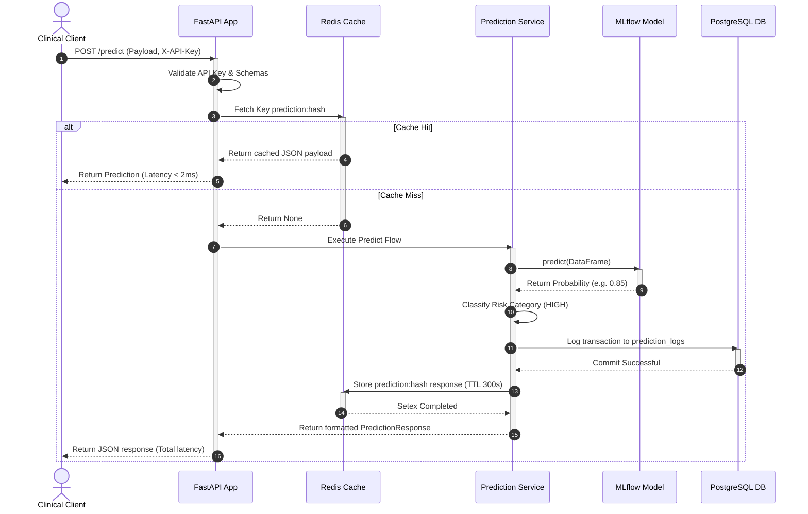

# Document 3: Architecture Diagram & Technical Design

This document details the HLD (High-Level Design) and LLD (Low-Level Design) mapping of the Enterprise Disease Risk Serving Platform.

---

## 1. High-Level Design (HLD)

The HLD illustrates the end-to-end integration from client request down to the caching, logging, and model registry systems.

```mermaid
graph TB
    subgraph Client Layer
        Clinician[Clinician Portal]
        EHR[EHR System]
    end

    subgraph Service Serving Layer
        API[FastAPI Gateway]
        InferenceEngine[MLflow Inference Engine]
        Auth[API Key Validator]
    end

    subgraph Cache Layer
        Redis[(Redis Cache)]
    end

    subgraph Database Layer
        Postgres[(PostgreSQL DB)]
    end

    subgraph Model MLOps Registry
        Registry[MLflow Server]
        Storage[(MLflow Model Artifacts)]
    end

    %% Routing Flow %%
    Clinician -->|POST /predict (API Key)| API
    EHR -->|GET /predictions| API
    
    API --> Auth
    API -->|1. Check Cache (MD5)| Redis
    API -->|2. Run Prediction| InferenceEngine
    API -->|3. Save Transaction logs| Postgres
    API -->|4. Store Response cache| Redis
    
    %% Registry Flow %%
    InferenceEngine -->|Pull stage='Production'| Registry
    Registry -->|Artifact retrieval| Storage
```

---

## 2. Low-Level Design (LLD)

### Business Architecture & Classification Rules
1. Patient readings are converted to standardized numeric ranges.
2. Binary categorical mapping:
   - `Male` $\rightarrow 1$, `Female` $\rightarrow 0$, `Other` $\rightarrow 0.5$
   - `family_history` (`True` $\rightarrow 1$, `False` $\rightarrow 0$)
3. Prediction classification rules:
   - $0.00 \le \text{Probability} \le 0.30 \rightarrow$ **LOW RISK** (`LOW_RISK`)
   - $0.31 \le \text{Probability} \le 0.70 \rightarrow$ **MEDIUM RISK** (`MEDIUM_RISK`)
   - $0.71 \le \text{Probability} \le 1.00 \rightarrow$ **HIGH RISK** (`HIGH_RISK`)

---

### Component Interaction Flow (Sequence Diagram)

This sequence diagram details the database connection pool checks and redis keys validations.



---

## 3. Storage Schema Design

### PostgreSQL table `prediction_logs`
- `id` (UUID, Primary Key)
- `patient_id` (VARCHAR(100), Index): Patient record key for history fetches.
- `request_data` (JSONB): Fully structured query payload.
- `prediction_result` (JSONB): Fully structured prediction response.
- `disease_probability` (FLOAT): Direct model risk score.
- `latency_ms` (FLOAT): Total latency of request processing.
- `model_version` (VARCHAR(50)): Version ID pulled from MLflow.
- `created_at` (TIMESTAMP): UTC creation time.
