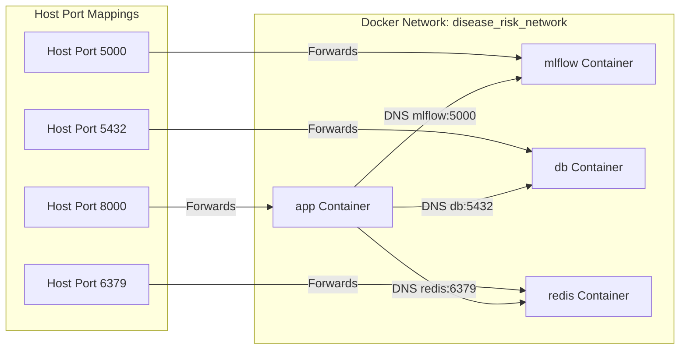

# Document 6: Deployment Guide

This guide details container architecture, network topology, volume mappings, and container deployment considerations.

---

## 1. Network Topology & Container Communication

The entire deployment runs inside a dedicated virtual bridge network (`disease_risk_network`) defined in the Compose file. This ensures isolation from host interfaces, and containers communicate using service names as hostname DNS resolvers:



1. **`db` (Postgres):** Listens on port `5432`.
2. **`redis` (Cache):** Listens on port `6379`.
3. **`mlflow` (Registry):** Listens on port `5000`. It runs an internal SQLite instance (`/mlflow/mlflow.db`) to track metadata and stores binary artifacts in `/mlflow/artifacts`.
4. **`app` (FastAPI):** Listens on port `8000`. On start, it queries `http://mlflow:5000` to fetch the model, processes client requests, validates credentials against its env secrets, and reads/writes to `db` and `redis`.

---

## 2. Storage & Volume Mounts

To ensure container persistence across teardowns, named volumes are mapped:
- **`postgres_data`:** Mapped to `/var/lib/postgresql/data`. Persists audit tables (`prediction_logs`) and user metadata.
- **`redis_data`:** Mapped to `/data`. Persists cached inferences.
- **`mlflow_data`:** Mapped to `/mlflow`. Persists the registry database file `mlflow.db` and model binary files (Random Forest weights, pickle parameters, signature metadata) in `artifacts/`.

---

## 3. Production Deployment Execution Steps

To launch the system in a production environment:

1. **Prepare Server Environments:** Ensure Docker is running. Configure CPU cores (minimum 2 vCPU, 4GB RAM recommended for serving ML models alongside database layers).
2. **Environment Variable Configuration:**
   - In production, replace `API_KEY` in `.env` with a strong 32-character key.
   - Restrict database accessibility by not exposing port `5432` to host external interfaces. Remove `"5432:5432"` port mapping from `docker-compose.yml` to prevent public database probes. Only the `app` container needs DB access within the internal bridge network.
3. **Run Daemon Build:**
   ```bash
   docker-compose up --build -d
   ```
4. **Inspect Health Checks:**
   Query standard health checks periodically from your host network monitoring script:
   ```bash
   curl -s -o /dev/null -w "%{http_code}" http://localhost:8000/health
   ```
   *Should return `200` once the bootstrap initialization finishes.*
5. **Horizontal Scaling of Serving App:**
   FastAPI app containers are stateless and can be scaled out:
   ```bash
   docker-compose up --scale app=3 -d
   ```
   *Note: Ensure an external Load Balancer (like NGINX, HAProxy, or AWS ALB) is configured to distribute traffic across these container instances on port `8000`.*
