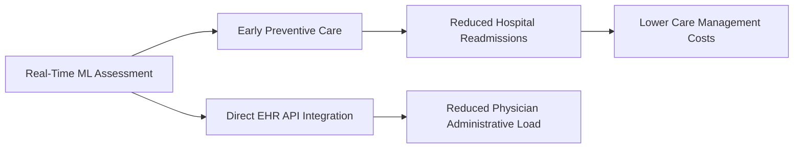

# Document 2: Healthcare Business Problem

## Clinical Context: Chronic Disease Management

Chronic diseases such as Diabetes, Heart Disease, and Chronic Kidney Disease represent a massive portion of global healthcare costs and patient mortality. Within clinical environments:
- Health indicators (BMI, blood pressure, fasting glucose, family history) are routinely collected by medical staff.
- Busy physicians often evaluate these variables individually rather than processing them through multi-variable risk models.
- Subtle combinations of high-normal indicators (e.g., moderate hypertension combined with elevated fasting glucose and mild obesity) can go unrecognized during short clinical evaluations.

This platform focuses primarily on **Diabetes Risk Prediction**, which affects hundreds of millions of patients worldwide, and where early intervention can reverse progression.

---

## Business Problem & Challenges

### 1. Diagnosis Delays
Hospitals and outpatient clinics deal with diagnostic latency. When diagnostic analysis is deferred or referred to specialized laboratories, patient follow-up rates drop. Late-stage diagnosis increases the risk of diabetic complications (neuropathy, retinopathy, nephropathy, and cardiovascular disease) that are costly to manage and lower patient quality of life.

### 2. Clinical Workflow Friction
Physicians cannot be expected to manually input patient metrics into external web calculators or run standalone command-line scripts during a 15-minute patient consultation. The lack of standardized, secure REST APIs that connect directly with **Electronic Health Records (EHR)** systems has limited the deployment of machine learning in daily clinical operations.

### 3. Patient Follow-up Compliance
If a clinical analyst cannot provide a patient's risk level during their initial diagnostic consultation, the chances of the patient returning for diagnostic tests or preventive lifestyle management decreases significantly.

---

## Business Impact & Value Proposition

By deploying the **Enterprise Disease Risk Serving Platform**, healthcare organizations achieve critical improvements:

1. **Reduced Hospital Readmissions:** Early detection allows for immediate care planning (such as metformin therapy, nutritional consulting, and exercise programs), preventing acute diabetic episodes.
2. **Standardized Clinical Risk Scoring:** Doctors receive a standardized risk level score (LOW, MEDIUM, HIGH) backed by machine learning probability values, eliminating subjectivity in risk assessment.
3. **Enterprise EHR Interoperability:** FastAPI REST endpoints serve predictions in milliseconds, allowing clinic software systems to fetch risk assessments during the patient check-in or assessment workflow.
4. **Data-driven Audit Trail:** All predictions are logged securely, giving hospital management and medical researchers access to aggregated, anonymous clinical profiles for epidemiological studies.
