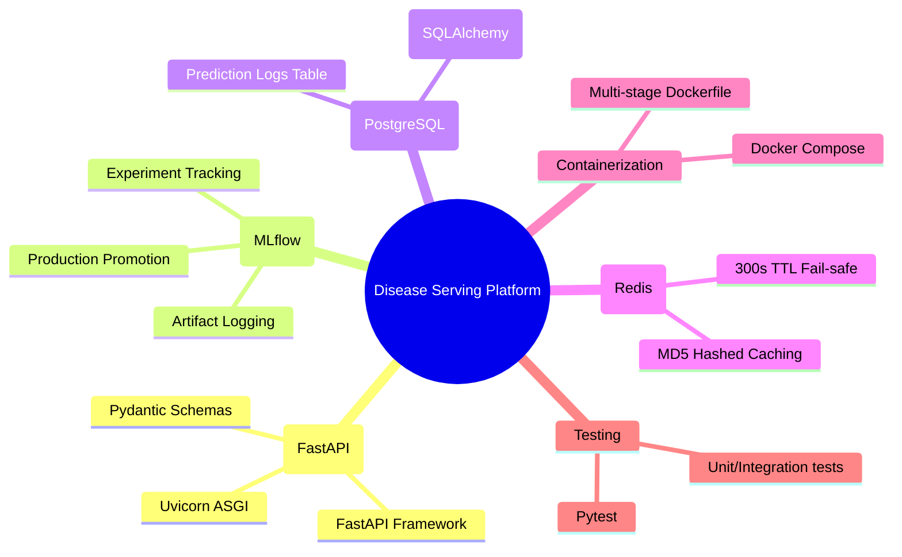

# Document 1: Project Overview

## Enterprise Disease Risk Serving Platform

The **Enterprise Disease Risk Serving Platform** is a production-grade, real-time machine learning (ML) model serving system designed for clinical risk assessment. The platform serves model predictions via a high-performance REST API, using modern MLOps architectures to decouple model lifecycle management from API service lifecycles.

### Objective
The core objective of the platform is to assess a patient's risk of developing chronic diseases (e.g., Diabetes) in real time. It enables medical professionals to make immediate, data-driven decisions during clinical visits by transforming raw diagnostic readings into actionable risk classifications.

---

## Technical Stack & MLOps Components

The system architecture utilizes a curated, robust tech stack selected for containerized scalability, latency optimization, and reproducibility:

- **Backend Framework:** FastAPI & Pydantic for high-speed, asynchronous request handling and validation.
- **Model Management:** MLflow Model Registry for experiment tracking and tracking models promoted to the `Production` stage.
- **Persistent Storage:** PostgreSQL database mapped through SQLAlchemy ORM to log and audit prediction logs.
- **Caching Engine:** Redis cache to check for identical requests, dropping latency to sub-millisecond rates.
- **Containerization:** Docker & Docker Compose for isolated microservices orchestration.
- **Quality Assurance:** Pytest testing suite running at 87% overall coverage.

---

## Core Value Proposition

1. **Decoupled MLOps Lifecycle:** ML models are trained, evaluated, and registered separately (via MLflow). The FastAPI application queries MLflow to pull the model tagged as `Production`, enabling continuous deployment (CD) of models without modifying serving code.
2. **Sub-millisecond Inference Caching:** Identical patient diagnostic payloads bypass ML evaluation and database writes by retrieving results directly from Redis caching.
3. **Resilience & Graceful Recovery:** All microservice communication timeouts (DB connection drops, Redis cache offline, MLflow registry timeouts) fall back to secure, standardized error responses.
4. **Clinical Auditing:** Every inference request, computed probability, classification risk level, model registry version, and system latency measurement is logged for future auditability.
