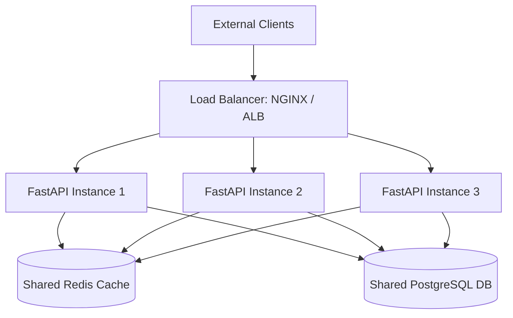

# Document 8: Scaling Guide (10,000+ Requests Per Minute)

This guide details the architectural decisions and system configurations required to scale the Enterprise Disease Risk Serving Platform to support high throughput (10k+ RPM) under low latency constraints.

---

## 1. Stateless API and Horizontal Scaling

The FastAPI application container is designed to be completely stateless. It does not store user sessions, cache state, or model parameters locally on disk in a way that prevents scaling out. 



To scale horizontally:
1. Run multiple instances of the `app` container.
2. Route traffic through a round-robin load balancer (e.g., NGINX, AWS Application Load Balancer).
3. Connect all instances to the same shared Redis cache and PostgreSQL database.

---

## 2. Multi-Worker Serving (Gunicorn + Uvicorn)

Running FastAPI with a single Uvicorn worker utilizes only one CPU core. In production environments, run Uvicorn under Gunicorn to manage multiple worker processes.

### Recommended Command:
```bash
gunicorn app.main:app \
    -w 4 \
    -k uvicorn.workers.UvicornWorker \
    -b 0.0.0.0:8000 \
    --max-requests 10000 \
    --max-requests-jitter 100
```
- **`-w 4`:** Runs 4 worker processes (Rule of thumb: $2 \times \text{number of CPU cores} + 1$).
- **`--max-requests 10000`:** Restarts worker processes after 10k requests to prevent slow memory leaks from expanding.

---

## 3. Database Connection Pooling

Database connection handshakes are expensive and limit throughput. In [`app/database/session.py`](file:///d:/10-MLOps-projects/Real-Time%20Disease%20Risk%20Prediction/app/database/session.py), we configured SQLAlchemy's connection pooling to reuse established database pipes:

```python
engine = create_engine(
    settings.database_url,
    pool_size=20,          # Keeps up to 20 persistent connections open per container
    max_overflow=15,       # Allows spikes up to 15 additional connections
    pool_timeout=30,       # Wait limit for free connections
    pool_recycle=1800,     # Recycle stale connections
    pool_pre_ping=True     # Test connection health before queries
)
```

With 3 scaled FastAPI containers, this configuration allows up to 105 concurrent connection threads to PostgreSQL, fully saturating database read/write throughput without exhaustion crashes.

---

## 4. Cache Hit Optimization (Redis)

Under high load (10k+ RPM), many incoming clinical requests represent repeated inputs or evaluations of the same patient profile.
- **MD5 Hash Keys:** The payload hashing converts large JSON structures into single 32-character strings.
- **Bypassing Database and Inference:** Redis cache hits return prediction results within **1-2ms**, completely bypassing the ML model computation and database transaction logging.
- **Scaling Redis:** If Redis memory fills up, configure the eviction policy in `redis.conf`:
  ```text
  maxmemory 2gb
  maxmemory-policy allkeys-lru
  ```
  This automatically evicts the Least Recently Used (LRU) prediction cache entries when memory reaches the 2GB limit.

---

## 5. Hardware Recommendations for 10k+ RPM

To ensure high performance under load:
- **FastAPI nodes (each):** 2 vCPUs, 4GB RAM.
- **Redis Node:** 2 vCPUs, 8GB RAM (optimized for high network IOPS).
- **PostgreSQL Node:** 4 vCPUs, 16GB RAM (SSD storage optimized for write-heavy logging).
